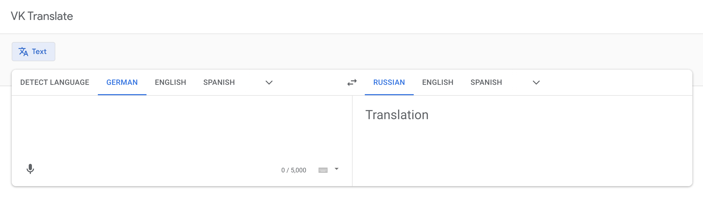
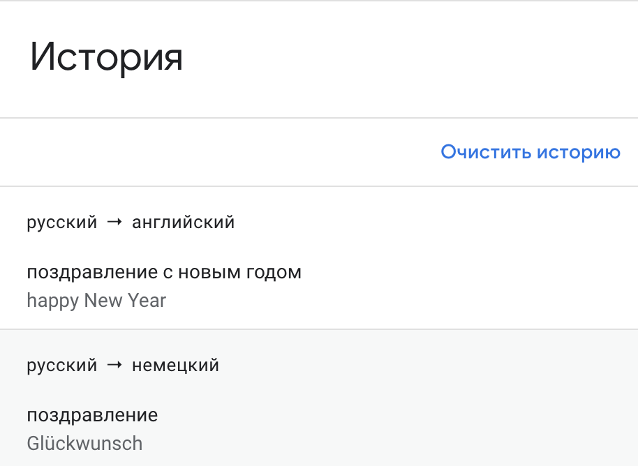

https://blackrule.github.io/2024-2-VK-EDU-Frontend-I-Chernovalov/  

# Экзамен

>Разработать web приложение "переводчик иностранных языков".

## Задание и критерии (каждый пункт === 4 балла, кроме последнего):

Код для первого пункта:

```bash
cd <ваш проект>
# 1. сохранить весь текущий прогресс, если такой имеется
# (git stash или git commit && git push)
# 2. Переключаемся в мастер и синхронизируемся с github
git checkout master
git pull origin master
# 3. создаём новый проект от master ветки в новой ветке
git checkout -b exam
npx create-react-app exam --template typescript # либо через vite
# (*) Если хотите сделать работу на простом JavaScript
npx create-react-app exam
```

Для разработки приложения необходимо использовать модуль, разработанный в рамках [`ДЗ13`](../lesson_13/homework.md).
Если ДЗ не выполнено, то ничего страшного, просто придется реализовать работу с API в рамках текущего задания (см. более подробную информацию об API ниже)

- [ ] В корневой папке репозитория создать базовое приложение `exam` с помощью [CRA](https://github.com/facebook/create-react-app#quick-overview) (или vite) по инструкции выше
- [ ] Сверстать 2 страницы и необходимые компоненты
- [ ] Использовать стили. Дизайн должен быть похожим на макет
- [ ] Реализовать перевод с одного языка на другой (нужно сделать так, чтобы можно было выбирать языки из выпадающего списка)
- [ ] Реализовать перевод с неизвестного языка (автоопределитель из `API`)
- [ ] Сохранять историю переводов в `localStorage`
- [ ] Использовать `Redux`
- [ ] Использовать `React-router` для перехода между страницами
- [ ] Задеплоить решение, используя `GitHub Actions`
- [ ] Ревью: получить правки по коду и исправить их (получаются лично у преподавателя и выполняются самостоятельно) [10 баллов]

## Примерные макеты

### Главная страница



На главной странице есть форма для ввода переводимой фразы, окно с результатом.

Интерфейс позволяет выбрать из списка исходный и целевой языки.


В интерфейсе должна быть кнопка для перехода на страницу с историей переводов

### История



На странице истории есть возможность прочитать предыдущие переводы и очистить историю.

## Информация по API

### Список языков

[`Файл с языками`](./languages.json)

```javascript
import languages from './languages.json';

// TODO: прокинуть в любое удобное место, где их нужно выводить
```
### Перевести

Для указания исходного и целевого языков, нужно указать параметр `langpair=` и коды языков, например `en|ru`.
Для автоматического определения исходного языка нужно указать в параметре значение `Autodetect`: `langpair=Autodetect|ru`

[Ссылка](https://mymemory.translated.net/doc/spec.php) на документацию API.

```javascript
const api = `https://api.mymemory.translated.net/get?q=${query}&langpair=${fromLanguage}|${toLanguage}`;

fetch(api).then(response => response.json()).then(data => console.log(data));
```


## Важно:

* Для сдачи экзамена необходимо создать `PR`, который должен включать в себя **только** проделанную работу.
В теле `PR` нужно указать эти 10 критериев (скопировать), чтобы было удобнее оценивать работу.
* Пользоваться можно всем, чем угодно.
* Задавать вопросы можно и нужно.
* Если мы заметим, что код был у кого-то списан, максимальный балл за работу будет равен 0.
* Если сидите над каким-то пунктом более 10 минут, не понимая, что делать - спрашивайте, поможем.

TODO debounce not enter


# React + TypeScript + Vite

This template provides a minimal setup to get React working in Vite with HMR and some ESLint rules.

Currently, two official plugins are available:

- [@vitejs/plugin-react](https://github.com/vitejs/vite-plugin-react/blob/main/packages/plugin-react/README.md) uses [Babel](https://babeljs.io/) for Fast Refresh
- [@vitejs/plugin-react-swc](https://github.com/vitejs/vite-plugin-react-swc) uses [SWC](https://swc.rs/) for Fast Refresh

## Expanding the ESLint configuration

If you are developing a production application, we recommend updating the configuration to enable type aware lint rules:

- Configure the top-level `parserOptions` property like this:

```js
export default tseslint.config({
  languageOptions: {
    // other options...
    parserOptions: {
      project: ['./tsconfig.node.json', './tsconfig.app.json'],
      tsconfigRootDir: import.meta.dirname,
    },
  },
})
```

- Replace `tseslint.configs.recommended` to `tseslint.configs.recommendedTypeChecked` or `tseslint.configs.strictTypeChecked`
- Optionally add `...tseslint.configs.stylisticTypeChecked`
- Install [eslint-plugin-react](https://github.com/jsx-eslint/eslint-plugin-react) and update the config:

```js
// eslint.config.js
import react from 'eslint-plugin-react'

export default tseslint.config({
  // Set the react version
  settings: { react: { version: '18.3' } },
  plugins: {
    // Add the react plugin
    react,
  },
  rules: {
    // other rules...
    // Enable its recommended rules
    ...react.configs.recommended.rules,
    ...react.configs['jsx-runtime'].rules,
  },
})
```
Generate runtypes from static types https://github.com/johngeorgewright/runtyping/tree/master/packages/runtypes  
https://github.com/runeh/json-to-runtypes
https://github.com/runtypes/runtypes/tree/v6.7.0
Make sure generated and actual types are identical https://www.npmjs.com/package/tsafe

