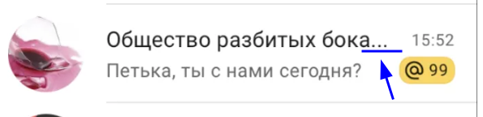

https://blackrule.github.io/2024-2-VK-EDU-Frontend-I-Chernovalov/  
simultaneous use in multiple tabs is not supported

## Почему innerHTML?

1) Вы уже видели что я знаю как переделать на DOM (см. `function addMessage`). Вообще я это ИИ поручил и снова могу, но незачем. innerHTML экономнее с точки зрения количества кода.
2) Для похожести на React и удобочитаемости
3) Достаточно экранировать данные
4) Я видел как делают customElement'ы и тд и везде все используют innerHTML... (там правда в shadowDOM, но какая разница)

## Почему нету ellipsis у имени чата в списке чатов?

Если мне можно делать дизайн по своему, то хочу чтобы у пользователя была возможность прочитать всё и ничего не обрезалось бы